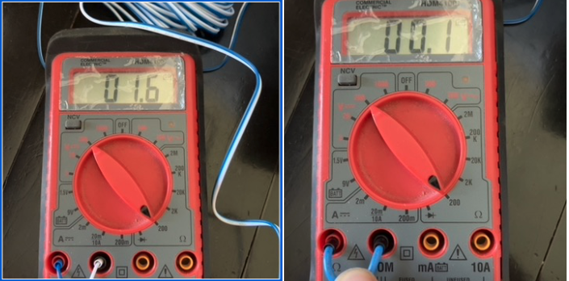

# ct-clamp-cable-length

A simple calculator for estimating how extra CT secondary burden (cable resistance) can impact measurement accuracy.

This project uses a **simplified, illustrative model** to show how the total resistance on a current transformer’s secondary circuit affects its relative error, especially at low currents. Real CT accuracy depends on CT design, rated burden, magnetising current and accuracy class; this model does *not* implement formal CT error calculations, but demonstrates the key dependency on burden.

---

## Overview

Current transformers (CTs) are used to step down high currents to a low signal suitable for meters and protection devices. In metering CTs, the secondary load (called the **burden**) affects how accurately the CT’s output current mirrors the primary current. Excessive burden increases ratio error and phase displacement in the measurement chain. :contentReference[oaicite:0]{index=0}

In standards like **IEC 61869-2**, CT accuracy classes (e.g., 0.2, 0.5, 1) and maximum burden ratings are defined so that ratio and phase errors remain within limits when operating under specified conditions. At very low currents or with burden exceeding the rated value, actual accuracy degrades, which is not uncommon in practical systems. :contentReference[oaicite:1]{index=1}

This example demonstrates how a fixed CT burden (in ohms) produces larger **relative error** at lower load levels, and smaller error at higher load levels.

## Inputs

Here is a photo of resistance wire measured with a multimeter, representing the extra burden from a long cable run on the CT secondary:


---

## How the model works

1. **Per-phase current calculation**

   Compute balanced three-phase current assuming line-to-line voltage of 240 V and unity power factor:

```

I_phase = P / (sqrt(3) * V_LL)

```

2. **Baseline CT secondary signal (mV)**

An assumed CT ratio of 100 A primary → 0.333 V secondary scales linearly:

```

V_sec_baseline = 0.333 * (I_phase / 100)

```

Converted to mV for convenience.

3. **Approximate error due to extra burden**

Real CTs have a rated burden (in ohms or VA) under which accuracy is specified. Our simplified model approximates the measured signal with extra burden and computes relative error:

```

Error% = ((Measured – Baseline) / Baseline) × 100

```

This treats extra resistance as proportionally increasing the effective burden on the CT.

*Note:* This is a proxy to illustrate the effect of burden — actual CT ratio and phase error formulas depend on manufacturer specifications and are defined in standards like IEC 61869-2. :contentReference[oaicite:2]{index=2}

---

## What this gives you

The resulting pandas DataFrame will show, for each power level from **10 W to 10 kW**:

* the computed **per-phase current (A)**,
* the **baseline secondary signal (mV)** expected from the CT,
* the **approximate % error** for a few values of extra burden (1 Ω, 2 Ω, 3 Ω) according to this illustrative model.

---

## Caveats and notes

* This method does **not** compute formal CT ratio or phase error per IEC/ANSI standards — those require detailed CT datasheet specifications, including rated burden, accuracy class, and magnetising parameters. :contentReference[oaicite:3]{index=3}
* The model above is **illustrative**: it uses a proportional approximation to show how extra burden impacts relative error.
* In practice, CT accuracy specifications depend on burden (expressed either as ohms or VA) and the applicable accuracy class (e.g., Class 0.5 means ≤0.5 % ratio error under rated conditions). :contentReference[oaicite:4]{index=4}

---

## Example references

* **Current transformer basics**: A CT steps down current, and its secondary must never be open-circuited when energized. :contentReference[oaicite:5]{index=5}
* **CT burden**: The secondary load of a CT is called burden, measured in ohms or VA; excessive burden reduces accuracy. :contentReference[oaicite:6]{index=6}
* **CT accuracy classes**: Defined in standards such as IEC 61869-2, which specify allowable measurement error under defined burden and current conditions. :contentReference[oaicite:7]{index=7}

---

## License

*MIT License*

© 2025 Powston. Licensed under the MIT License. See LICENSE file for details.

```
